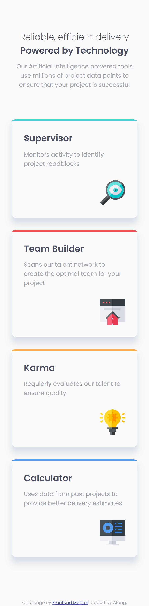
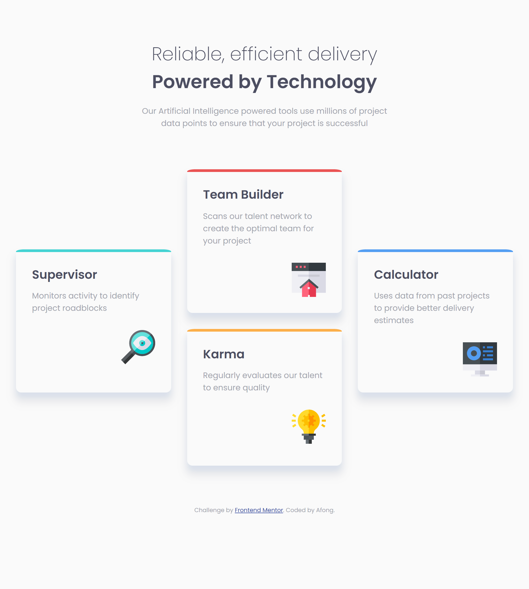

# Frontend Mentor - Four card feature section solution

This is a solution to the [Four card feature section challenge on Frontend Mentor](https://www.frontendmentor.io/challenges/four-card-feature-section-weK1eFYK). Frontend Mentor challenges help you improve your coding skills by building realistic projects.

## Table of contents

- [The challenge](#the-challenge)
- [Screenshot](#screenshot)
- [Links](#links)
  - [Built with](#built-with)
  - [What I learned](#what-i-learned)
  - [Useful resources](#useful-resources)

### The challenge

Users should be able to:

- View the optimal layout for the site depending on their device's screen size

### Screenshot




### Links

- Solution URL: [GitHub](https://github.com/Afonguwu/Frontend-Mentor-Practice/tree/master/four-card-feature-section-master)
- Live Site URL: [Pages](https://afonguwu.github.io/Frontend-Mentor-Practice/four-card-feature-section-component-master/index.html)

### Built with

- Semantic HTML5 markup
- CSS custom properties
- CSS Grid
- Mobile-first workflow
- Scss

### What I learned

```scss
.container {
	width: 100%;
	@media (min-width: $desktop) {
		display: grid;
		grid-template-columns: repeat(3, 1fr);
		gap: 2em;
	}
}
.grid-one {
	@media (min-width: $desktop) {
		grid-column: 1/2;
		grid-row: 2/4;
	}
}

.grid-two {
	@media (min-width: $desktop) {
		grid-column: 2/3;
		grid-row: 1/3;
	}
}

.grid-three {
	@media (min-width: $desktop) {
		grid-column: 2/3;
		grid-row: 3/5;
	}
}

.grid-four {
	@media (min-width: $desktop) {
		grid-column: 3/4;
		grid-row: 2/4;
	}
}
```

### Useful resources

- [CSS grid](https://developer.mozilla.org/zh-CN/docs/Web/CSS/CSS_grid_layout/Basic_concepts_of_grid_layout)
