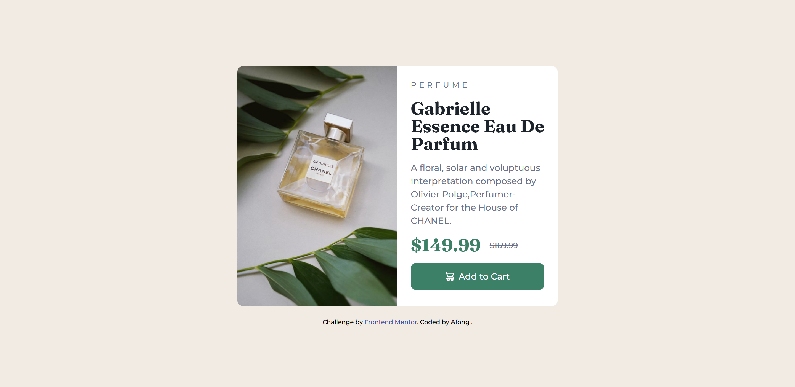

# Frontend Mentor - Product preview card component solution

This is a solution to the [Product preview card component challenge on Frontend Mentor](https://www.frontendmentor.io/challenges/product-preview-card-component-GO7UmttRfa). Frontend Mentor challenges help you improve your coding skills by building realistic projects.

## Table of contents

- [Overview](#overview)
  - [The challenge](#the-challenge)
  - [Screenshot](#screenshot)
- [My process](#my-process)
  - [Built with](#built-with)
  - [What I learned](#what-i-learned)
- [Author](#author)

**Note: Delete this note and update the table of contents based on what sections you keep.**

## Overview

A product preview card component with flex box.

### The challenge

Users should be able to:

- View the optimal layout depending on their device's screen size
- See hover and focus states for interactive elements

### Screenshot

## My process

- Read ` style-guide.md` and set SCSS environment(variables, fonts, simple reset)
- Build the structure in `index.html` and put the image
- Set customized style
- Set response style
- Check whether everything meets expectations
- Edit `README.md` and push to GitHub

### Built with

- Semantic HTML5 markup
- SCSS custom properties
- Flexbox
- Mobile-first workflow

### What I learned

- Be clearer with <picture> tag:
  -  is necessary
  - The size of <source> will depend on  setting
  -  can't set `media` property,<source> can
  - If all pictures are the same type, `type` property can ignored.

## Author

- Frontend Mentor - [@Afonguwu](https://www.frontendmentor.io/profile/Afonguwu)
