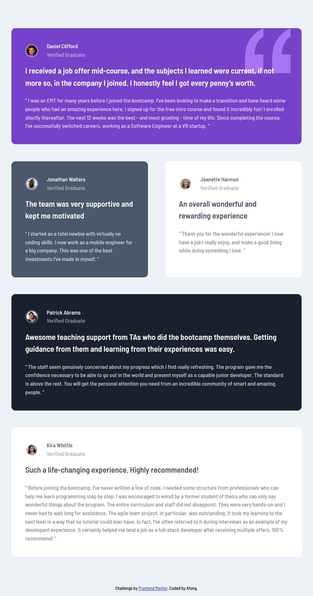
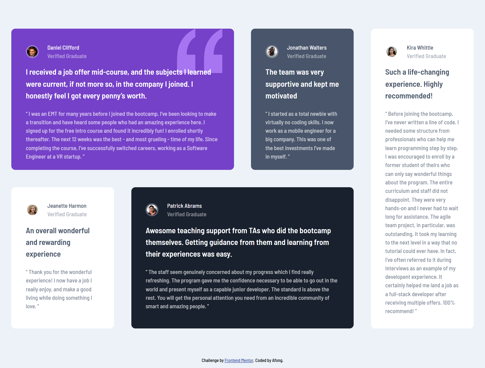

# Frontend Mentor - Testimonials grid section solution

This is a solution to the [Testimonials grid section challenge on Frontend Mentor](https://www.frontendmentor.io/challenges/testimonials-grid-section-Nnw6J7Un7). Frontend Mentor challenges help you improve your coding skills by building realistic projects. 

## Table of contents

  - [The challenge](#the-challenge)
  - [Screenshot](#screenshot)
  - [Links](#links)
- [My process](#my-process)
  - [Built with](#built-with)
  - [What I learned](#what-i-learned)

**Note: Delete this note and update the table of contents based on what sections you keep.**

### The challenge

Users should be able to:

- View the optimal layout for the site depending on their device's screen size

### Screenshot

### Links

- Solution URL: [GitHub](https://github.com/Afonguwu/Frontend-Mentor-Practice/tree/master/testimonials-grid-section-main)
- Live Site URL: [Pages](https://afonguwu.github.io/Frontend-Mentor-Practice/testimonials-grid-section-main/index.html)

## My process
- Set variables & base 
- Build HTML
- Add customized style
- Add pad & desktop setting
- Write README
- Deploy 

### Built with

- Semantic HTML5 markup
- SCSS custom properties
- Flexbox
- CSS Grid
- Mobile-first workflow

### What I learned

Don't write the wrong words , check it again and again...

